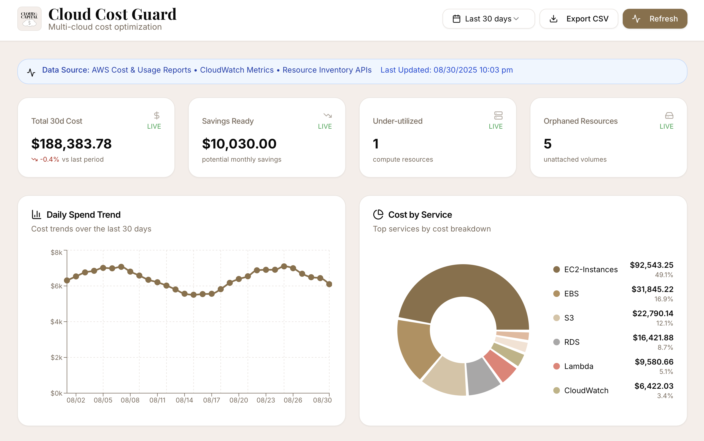
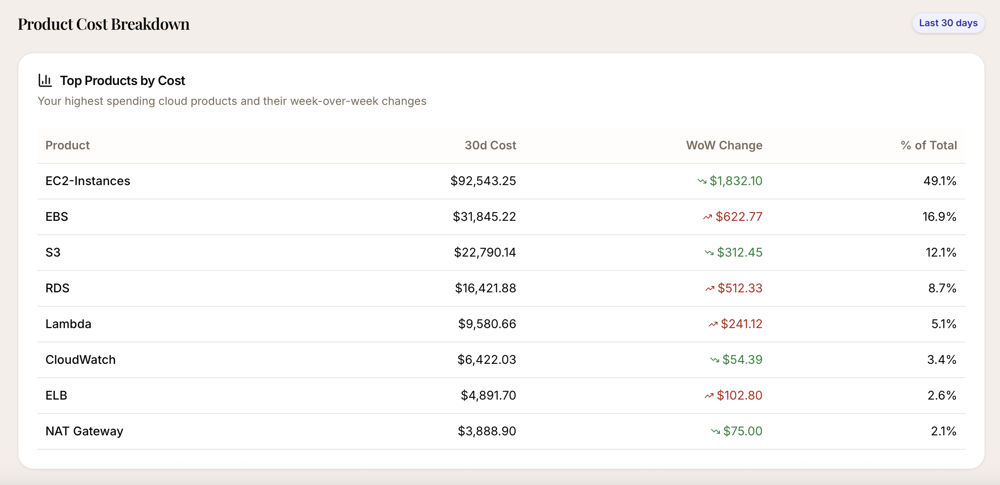
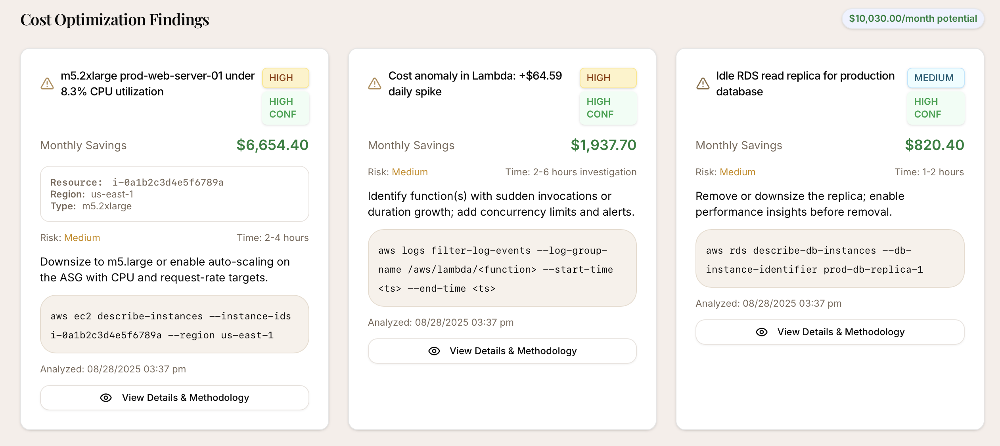

# Cloud Cost Guard

> A clean cloud cost observability dashboard that highlights daily spend trends, cost by service, **top movers**, and **prioritized savings opportunities** with evidence and methodology.

[**Live Demo →**](https://guard.cloudandcapital.com) • [**Code (GitHub)**](https://github.com/dianuhs/cloud-cost-guard)

---

- Focuses on **actionable savings**
- Clear **findings cards** with **evidence** (resource, region, type)
- **Daily spend trend** + **service breakdown** + **top movers** to explain changes
- Simple **CSV export** of findings with savings
- Professional, consistent UI with a Cloud & Capital theme

## Screenshots

**Dashboard**  


**Products**  


**Findings**  


---

## Quickstart

```bash
# Node 20+ is recommended
npm install

# Start dev server (CRA)
npm start

# Production build
npm run build
```

### API
The frontend expects the following endpoints at `/api` (same-origin or via proxy):

- `GET /api/summary?window=7d|30d|90d`
- `GET /api/findings?sort=savings&limit=50`
- `GET /api/movers?window=7d`

If you're running a backend on a different port for local dev, add a CRA dev proxy in `package.json`:

```json
{ "proxy": "http://localhost:5000" }
```

Or, you can parameterize an API base via env (see **.env.example**).

---

## Tech
- React (CRA + craco), Recharts, shadcn/ui, lucide-react
- Vercel for hosting
- Tight, consistent styling in `App.css` (brand tokens + utilities)

---

## Project structure (high-level)

```
src/
  App.js
  App.css
  assets/
  components/ui/...
public/
```

---

## Accessibility & UX
- Alt text on images (brand logo)
- Color contrast tuned for body text & emphasis
- Icons normalized across severities to avoid visual jitter
- Evidence panels use smaller mono text for legibility without clutter

---

## Contributing
PRs and issues are welcome. For local development, see **Quickstart** above.

---

## License
This project is licensed under the **MIT License**. See [LICENSE](LICENSE) for details.


