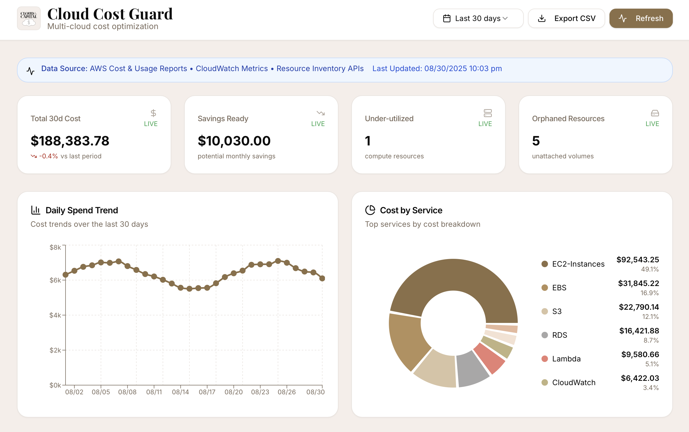
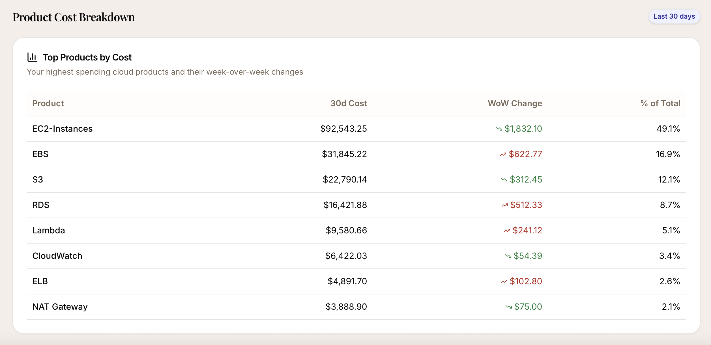
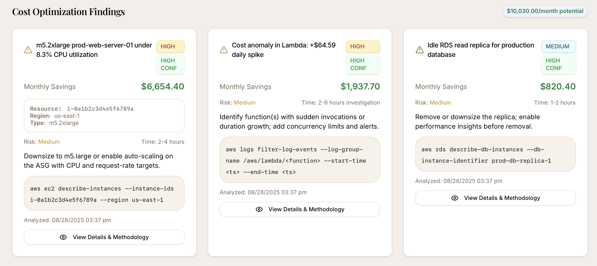

# Cloud Cost Guard

[](https://github.com/cloudandcapital/cloud-cost-guard/actions/workflows/test.yml)

**Part of the Visibility → Variance → Tradeoffs pipeline.**

| Tool | Role | Repo |
|------|------|------|
| FinOps Lite | Cost visibility — AWS/Azure/GCP spend, FOCUS 1.0 export | [cloudandcapital/finops-lite](https://github.com/cloudandcapital/finops-lite) |
| FinOps Watchdog | Anomaly detection — spend spikes from any cost CSV | [cloudandcapital/finops-watchdog](https://github.com/cloudandcapital/finops-watchdog) |
| Recovery Economics | Resilience modeling — backup/restore cost + scenario compare | [cloudandcapital/recovery-economics](https://github.com/cloudandcapital/recovery-economics) |
| AI Cost Lens | AI spend observability — model-level cost across OpenAI, Anthropic, Bedrock | [cloudandcapital/ai-cost-lens](https://github.com/cloudandcapital/ai-cost-lens) |
| SaaS Cost Analyzer | SaaS spend governance — unused licenses, per-seat costs, forecasting | [cloudandcapital/saas-cost-analyzer](https://github.com/cloudandcapital/saas-cost-analyzer) |
| **Cloud Cost Guard** | Dashboard — spend trends, savings coverage, rightsizing | [cloudandcapital/cloud-cost-guard](https://github.com/cloudandcapital/cloud-cost-guard) |
| Tech Spend Command Center | Executive summary — unified Cloud+AI+SaaS report | [cloudandcapital/tech-spend-command-center](https://github.com/cloudandcapital/tech-spend-command-center) |

Six tools. One pipeline. Full Cloud+AI+SaaS coverage for every scope the FinOps Foundation 2026 Framework defines.

---

> A cloud cost observability dashboard that highlights daily spend trends, cost by service, top movers, and prioritized savings opportunities with evidence and methodology.

[**Live Demo →**](https://guard.cloudandcapital.com) • [**Code (GitHub)**](https://github.com/cloudandcapital/cloud-cost-guard)

---

- Clear findings cards with evidence (resource, region, type)
- Simple CSV export of findings with savings

## Screenshots

**Dashboard**


**Products**


**Findings**


---

## Quickstart

```bash
# Node 20+ is recommended
npm install

# Start dev server (CRA)
npm start

# Production build
npm run build
```

### API
The frontend expects the following endpoints at `/api` (same-origin or via proxy):

- `GET /api/summary?window=7d|30d|90d`
- `GET /api/findings?sort=savings&limit=50`
- `GET /api/movers?window=7d`

If you're running a backend on a different port for local dev, add a CRA dev proxy in `package.json`:

```json
{ "proxy": "http://localhost:5000" }
```

Or, you can parameterize an API base via env (see **.env.example**).

---

## Cloud & Capital Architecture

Cloud Cost Guard is a read-only dashboard that visualizes cloud financial signals produced by a small set of purpose-built Cloud & Capital tools. The dashboard itself does not fetch cloud data directly. Instead, it consumes a single normalized JSON document (`report.json`) generated by local CLI tooling. This keeps the UI decoupled from data collection, analysis, and modeling concerns.

## Data Pipeline

The dashboard is powered by four tools, each with a narrow responsibility:

- **[FinOps Lite](https://github.com/cloudandcapital/finops-lite)** — AWS Cost Explorer CLI. Pulls account-level cloud cost data. Produces structured cost summaries (totals, trends, top services) and FOCUS 1.0 CSV exports. Output is used as the cost baseline.
- **[FinOps Watchdog](https://github.com/cloudandcapital/finops-watchdog)** — CSV-driven anomaly detector. Identifies sustained spend spikes versus historical baselines. Emits machine-readable anomaly payloads with severity and deltas, plus markdown summaries via `--report`. Output is used for anomaly counts and "top movers."
- **[Recovery Economics](https://github.com/cloudandcapital/recovery-economics)** — Resilience and backup cost modeling CLI. Calculates monthly storage, restore, and total resilience cost per workload; supports `compare` subcommand for scenario-level delta analysis. Output is used for resilience cost visibility.
- **Cloud Capital Report** — Lightweight aggregator. Combines outputs from FinOps Lite, Watchdog, and Recovery Economics. Normalizes them into a single `report.json` schema. Acts as the contract between backend tooling and the dashboard.

## Unified Report Schema

Cloud Cost Guard reads only from `frontend/src/data/report.json`. The report includes:

- Cost baseline summary (from FinOps Lite)
- Anomaly metrics and recent anomalies (from Watchdog)
- Resilience cost totals and top workloads (from Recovery Economics)
- Window metadata and generation timestamp

Because the dashboard depends only on this schema, data sources can evolve without requiring UI changes.

## Local Demo Workflow

1. Run FinOps Lite to generate a cost overview JSON (and FOCUS 1.0 CSV export).
2. Run FinOps Watchdog on a local CSV to generate anomalies JSON.
3. Run Recovery Economics on a workload CSV to generate resilience JSON.
4. Run Cloud Capital Report to aggregate all three into `report.json`.
5. Start the Cloud Cost Guard frontend to visualize the results.

The `report.json` committed in this repository serves as a demo artifact. In a real deployment, it could be generated on a schedule or via CI.

## Tech

- React (CRA + craco), Recharts, shadcn/ui, lucide-react
- Vercel for hosting
- Styling in `App.css` (brand tokens + utilities)

---

## Project Structure

```
src/
  App.js
  App.css
  assets/
  components/ui/...
public/
```

---

## Contributing

PRs and issues are welcome. For local development, see **Quickstart** above.

---

## License

MIT © 2025 Diana Molski, Cloud & Capital
